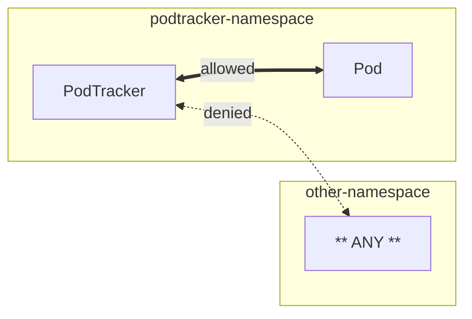

# podtracker

A Helm chart for deploying PodTracker to a Kubernetes cluster

  

A Helm chart for deploying PodTracker to a Kubernetes cluster

**Homepage:** <https://aurora.gccloudone.alpha.canada.ca>

## Maintainers

| Name | Email | Url |
| ---- | ------ | --- |
| Aurora / Aurore | <aurora-aurore@ssc-spc.gc.ca> |  |

## Source Code

* <https://github.com/gccloudone-aurora/podtracker>

## Requirements

Kubernetes: `>= 1.16.0-0`

## Installing the Chart

*Not available yet. Coming soon.*

To install the chart:

```console
helm repo add aurora-artifactory https://artifactory.ssc-spc.gc.ca/helm/to-be-created
helm repo update
helm upgrade --install podtracker aurora-artifactory/podtracker
```

## Default Network Policies

While you can extend Network Policies through the [provided Helm chart](/install/kubernetes/podtracker/), the following is provided by default.


> PodTracker by default can communicate with anything in its own namespace and anything in its own namespace can communicate with it.
>
> Any other traffic is denied by default

## Values

| Key | Type | Default | Description |
|-----|------|---------|-------------|
| affinity | object | `{}` | specifies pod affinities and anti-affinities for the podtracker deployment |
| fullnameOverride | string | `""` |  |
| image.pullPolicy | string | `"IfNotPresent"` | can be one of "Always", "IfNotPresent", "Never" |
| image.repository | string | `"aurora/podtracker"` | the source image repository |
| imagePullSecrets | list | `[]` | specifies credentials for a private registry to pull source image |
| leaderElectionEnabled | bool | `true` | specifies whether or not to enable leader-election for the podtracker controller |
| nameOverride | string | `""` |  |
| networkPolicies.enabled | bool | `false` | specifies whether or not to deploy network policies |
| networkPolicies.extraPolicies | list | `[]` | acceptable input includes a name followed by a valid NetworkPolicy spec |
| nodeSelector | object | `{}` | specifies a selector for determining where the podtracker controller pods will be scheduled |
| podAnnotations | object | `{}` |  |
| podSecurityContext | object | `{}` |  |
| podtrackerConfiguration | list | `[]` | configuration options for deployment of a PodTracker CR with this chart |
| priorityClassName | string | `""` | indicates the Pod priority and hence importance of a Pod relative to other Pods. |
| prometheus.enabled | bool | `true` | resource. |
| prometheus.podmonitor.annotations | object | `{}` | Additional annotations to add to the PodMonitor. |
| prometheus.podmonitor.enabled | bool | `false` | Create a PodMonitor to add podtracker to Prometheus. |
| prometheus.podmonitor.endpointAdditionalProperties | object | `{}` | endpoint such as relabelings, metricRelabelings etc.  For example:  endpointAdditionalProperties:   relabelings:   - action: replace     sourceLabels:     - __meta_kubernetes_pod_node_name     targetLabel: instance  +docs:property |
| prometheus.podmonitor.honorLabels | bool | `false` | Keep labels from scraped data, overriding server-side labels. |
| prometheus.podmonitor.interval | string | `"60s"` | The interval to scrape metrics. |
| prometheus.podmonitor.labels | object | `{}` | Additional labels to add to the PodMonitor. |
| prometheus.podmonitor.path | string | `"/metrics"` | The path to scrape for metrics. |
| prometheus.podmonitor.prometheusInstance | string | `"default"` | different PodMonitors. |
| prometheus.podmonitor.scrapeTimeout | string | `"30s"` | The timeout before a metrics scrape fails. |
| prometheus.servicemonitor.annotations | object | `{}` | Additional annotations to add to the ServiceMonitor. |
| prometheus.servicemonitor.enabled | bool | `true` | Create a ServiceMonitor to add podtracker to Prometheus. |
| prometheus.servicemonitor.endpointAdditionalProperties | object | `{}` | endpoint such as relabelings, metricRelabelings etc.  For example:  endpointAdditionalProperties:   relabelings:   - action: replace     sourceLabels:     - __meta_kubernetes_pod_node_name     targetLabel: instance  +docs:property |
| prometheus.servicemonitor.honorLabels | bool | `false` | Keep labels from scraped data, overriding server-side labels. |
| prometheus.servicemonitor.interval | string | `"60s"` | The interval to scrape metrics. |
| prometheus.servicemonitor.labels | object | `{}` | Additional labels to add to the ServiceMonitor. |
| prometheus.servicemonitor.path | string | `"/metrics"` | The path to scrape for metrics. |
| prometheus.servicemonitor.prometheusInstance | string | `"default"` | different ServiceMonitors. |
| prometheus.servicemonitor.scrapeTimeout | string | `"30s"` | The timeout before a metrics scrape fails. |
| prometheus.servicemonitor.targetPort | int | `9003` | podtracker controller is listening on for metrics. |
| rbac.create | bool | `true` | should rbac resources be created for podtracker |
| replicaCount | int | `2` | number of replicas to create for the controller |
| resources | object | `{}` |  |
| securityContext.runAsNonRoot | bool | `true` |  |
| serviceAccount.annotations | object | `{}` | annotations to add to the service account |
| serviceAccount.create | bool | `true` | specifies whether a service account should be created |
| serviceAccount.name | string | `""` | if not set and create is true, a name is generated using the fullname template |
| tolerations | list | `[]` | specifies which taints can be tolerated by the podtracker controller |
| topologySpreadConstraints | list | `[]` | specifies how pods should be scheduled across multiple nodes |
| webhooksEnabled | bool | `true` | enable default and validating webhooks |
